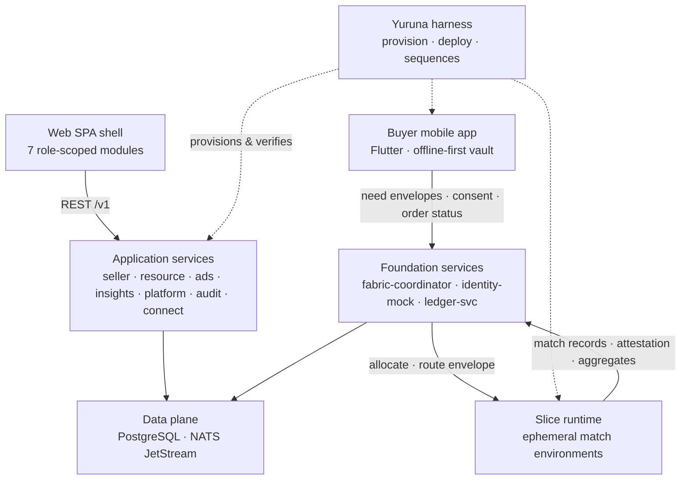
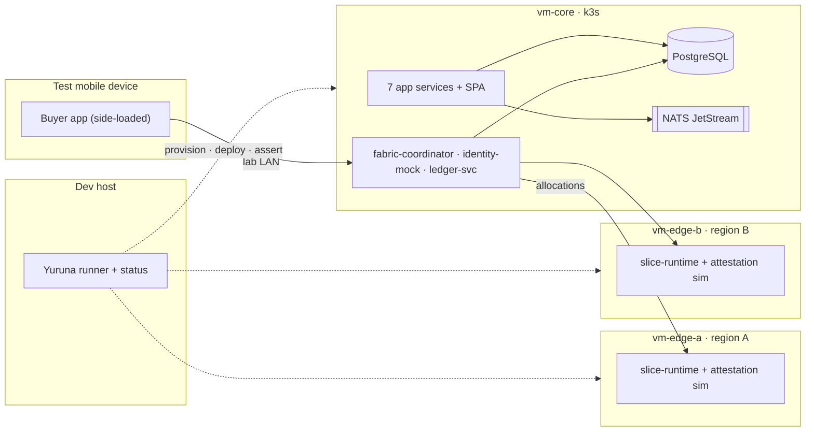

# POC overview

> One sentence: the seven top-level blocks of the AmisAd POC and the four lab nodes they deploy to.

See [00-index.md](00-index.md) · [../design.md](../design.md).

## Level-1 components

| Block | Realization | Defined in |
|-------|-------------|-----------|
| Buyer mobile app | Flutter, side-loaded; the only holder of individual data | [02-buyer.md](02-buyer.md) |
| Web SPA shell | React + TS, one build, role-scoped modules, served from the cluster | docs 3–9 |
| Application services | Seven Rust services, one Cargo workspace | docs 3–9 |
| Foundation services | Fabric coordinator, OIDC-style mock issuer, three hash-chained ledgers | [../design.md](../design.md) §4 |
| Slice runtime | Stateless Rust binary on edge VMs; one process per match | [../design.md](../design.md) §2 |
| Data plane | One PostgreSQL (schema per service) + NATS JetStream, in-cluster | [../design.md](../design.md) §1 |
| Yuruna harness | VM provisioning, deployment, SCENARIO-001…010 as sequences | [../scenarios.md](../scenarios.md) |

## Deployment topology

Two edge VMs are the minimum honest topology: SCENARIO-004 asserts a jurisdiction-restricted allocation choosing the compliant region, and SCENARIO-009 asserts one region above and one below the anonymity threshold. The slice VMs hold no state; a reboot must be indistinguishable from a fresh provision.
