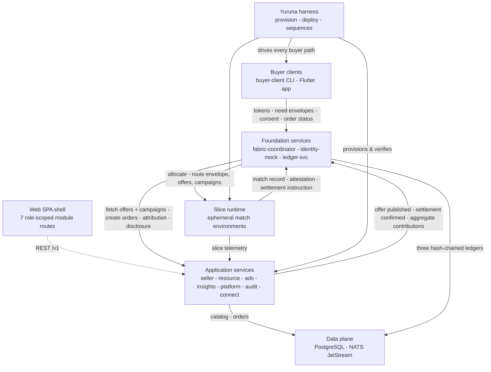
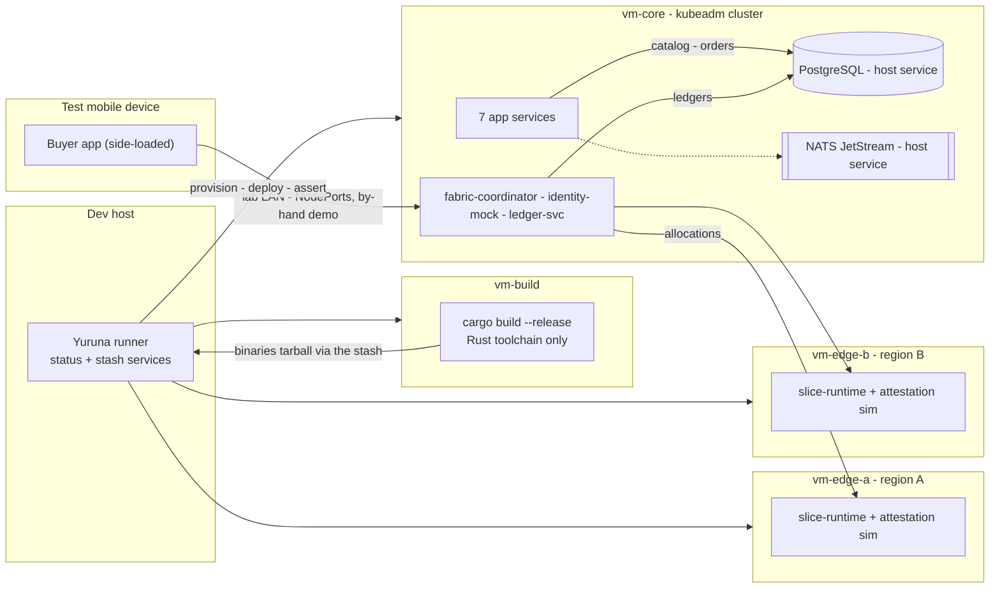

# POC overview

> One sentence: the seven top-level blocks of the AmisAd POC and the lab nodes they deploy to.

See [../design.md](../design.md#9-diagrams). Dashed = designed, not built.

## Level-1 components

| Block | Realization | Defined in |
|-------|-------------|-----------|
| Buyer clients | `buyer-client`, a headless Rust CLI, is the scenario driver and the only holder of individual data; the side-loaded Flutter app carries the same path for the by-hand demo | [02-buyer.md](02-buyer.md) |
| Web SPA shell | React + TS, one build, seven module routes -- a shell whose workspaces are placeholders, not deployed to the cluster | docs 3-9 |
| Application services | Seven Rust services, one Cargo workspace | docs 3-9 |
| Foundation services | Fabric coordinator, mock token issuer, three hash-chained ledgers | [../design.md](../design.md) section 4 |
| Slice runtime | Stateless Rust binary on edge VMs; one attested environment per dispatch | [../design.md](../design.md) section 2 |
| Data plane | One PostgreSQL (schema per service) for the ledgers and the seller store; NATS JetStream provisioned, its subjects still carried as direct HTTP notifies | [../design.md](../design.md) section 1 |
| Yuruna harness | VM provisioning, deployment, s001...s010 as sequences | [../scenarios.md](../scenarios.md) |

## Deployment topology

Two edge VMs are the minimum honest topology (see [../design.md](../design.md) section 2): s004.failover asserts a jurisdiction-restricted allocation choosing the compliant region, and s009.suppression asserts one region above and one below the anonymity threshold. The slice VMs hold no state -- a reboot is indistinguishable from a fresh provision, and `slice-runtime` is delivered to them per scenario run.

**vm-build compiles; vm-core runs.** Only vm-build holds a Rust toolchain: it produces the release binaries once per run and publishes them to the host's stash service, and vm-core downloads that tarball, builds thin images from it, and deploys the ten services. vm-core therefore never carries a compiler, which is what keeps it shaped like a production node.

Services are reached on NodePorts 30080-30089 (there is no ingress in the POC), and PostgreSQL and NATS are host services on vm-core that in-cluster pods dial over the node network rather than in-cluster workloads.

---

LICENSEURI https://yuruna.link/license

Copyright (c) 2026 by Alisson Sol et al.
