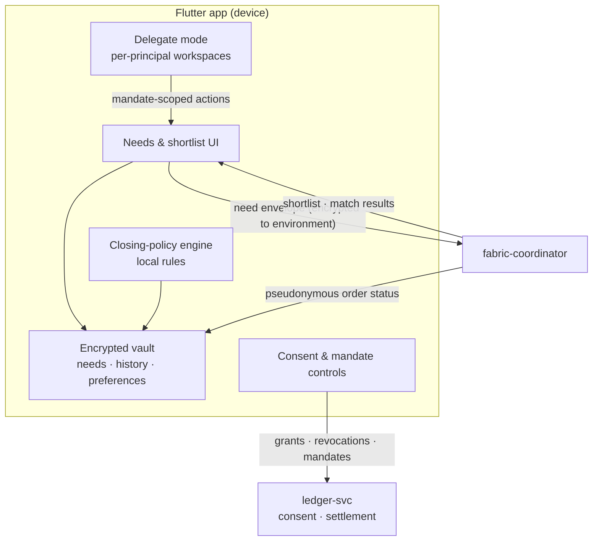

# AmisAd/buyer — POC design

> One sentence: the Flutter buyer app holds the only copy of personal data in an encrypted on-device vault and reaches the ecosystem exclusively through need envelopes, consent records, and pseudonymous order channels.

See [../design.md](../design.md#9-diagrams) · [../applications.md](../applications.md#amisadbuyer).

**POC notes**

- **No buyer backend service exists.** The vault is device-resident (encrypted local storage); nothing syncs server-side. Losing the device loses the vault — acceptable for POC; vault backup is a growth-path item, designed as user-held key escrow, never a server copy.
- **Matching path:** the app encrypts each need as an envelope keyed to the ephemeral environment; the coordinator routes it; core services never see plaintext. On-device matching is deferred (POC always uses edge slices) behind the same envelope contract.
- **Closing policies** evaluate locally: auto-close emits a signed acceptance inside the envelope; manual needs return shortlists for explicit decisions (SCENARIO-002 asserts nothing commits without one).
- **Delegate mode** signs in as the delegate actor (identity-mock JWT), shows only mandate-scoped views per principal, and routes over-cap closings to the principal as approval handoffs; every action carries dual attribution.
- **Notifications** are local push from subscribed pseudonymous subjects; the silence assertions (SCENARIO-002/003) count them.

**Scenario coverage:** 001, 002, 003, 005, 006, 008.

---

LICENSEURI https://yuruna.link/license

Copyright (c) 2026 by Alisson Sol et al.
