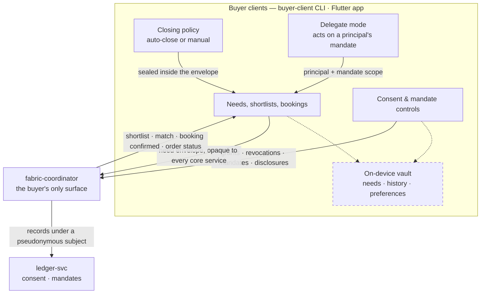

# AmisAd/buyer — POC design

> One sentence: the buyer client holds the only copy of personal data and reaches the ecosystem exclusively through need envelopes, consent records, and pseudonymous order channels — never through a buyer backend.

See [../design.md](../design.md#9-diagrams) · [../applications.md](../applications.md#amisadbuyer). Dashed = designed, not built.

**POC notes**

- **Two clients, one contract.** `buyer-client` is a headless Rust CLI and the scenario driver — needs, shortlists, bookings, consent, mandates, delegated needs, approvals, disclosure grants, the activity trail. The side-loaded Flutter app carries the need → match → status path over the same APIs for the by-hand demo. Both authenticate with an `identity-mock` actor token.
- **No buyer backend service exists,** and the coordinator is the client's only surface: consent and mandate records reach `ledger-svc` through it, under a subject pseudonym the coordinator derives from the verified actor, so the ledger never sees a name. The vault is the design's device-resident store; the POC clients keep their working state in process instead, and durable encrypted storage — with backup as user-held key escrow, never a server copy — is a growth-path item.
- **Matching path:** the client seals each need into an envelope addressed to the ephemeral environment; the coordinator carries it as an opaque string it never parses and routes it; core services never see the contents. On-device matching is deferred (POC always uses edge slices) behind the same envelope contract.
- **Closing policy travels with the need,** sealed in the envelope, and the environment applies it: auto-close commits inside the environment, manual returns a shortlist for an explicit decision (s002.fitting asserts nothing commits without one, then that the booking is the commitment).
- **Delegate mode** names the principal on every delegated need. Mandate scope — category, per-item cap, expiry — lives in the coordinator and is checked *before* dispatch, so an out-of-scope need creates no environment; an over-cap match is held until the principal's recorded approval; and every closing carries dual attribution to the principal's activity trail. Binding the delegate to the principal in the token itself is a growth-path item; the POC issues an ordinary actor token and enforces the binding in the mandate.
- **Notifications** are a per-handle log on the coordinator that the client polls; the silence assertions (s002/s003) count its entries.

**Scenario coverage:** every scenario except s009.suppression — s001.fulfillment, s002.fitting, s003.silence, s004.failover, s005.attribution, s006.mandate, s007.inventory, s008.mediation, s010.certification.

---

LICENSEURI https://yuruna.link/license

Copyright (c) 2026 by Alisson Sol et al.
