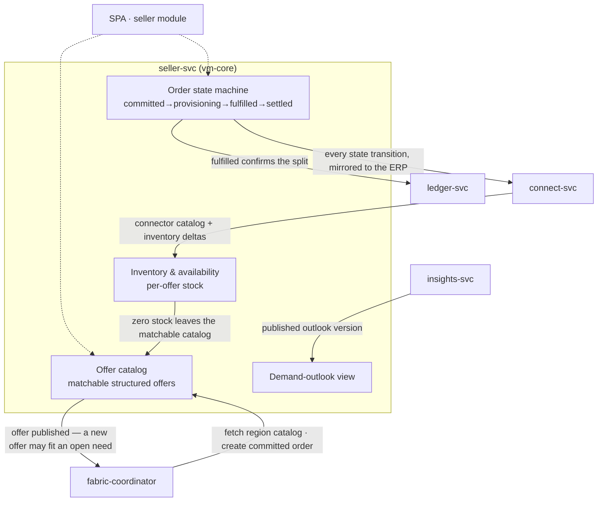

# AmisAd/seller — POC design

> One sentence: seller-svc runs the multi-tenant catalog, inventory, and order state machine that matching consumes and settlement pays — fed by hand through the `/v1` API, by the SPA module once it exists, or by connectors through AmisAd/connect.

See [../design.md](../design.md#9-diagrams) · [../applications.md](../applications.md#amisadseller). Dashed = designed, not built.

**POC notes**

- **Multi-tenant from day one:** tenant ID on every row in the `seller` schema; scenario seeds create Elena plus the deliberately out-of-range seller s002.fitting asserts is filtered.
- **Matchability is the catalog's contract:** offers carry structured attributes (price, exclusion-relevant fields like color, reach, fitting slots, standing-deal terms) so environments evaluate them without interpretation.
- **The order state machine starts at `committed`:** a closed match creates the order already committed, the seller advances it through `provisioning` to `fulfilled`, and `settled` is reached only internally, when the ledger confirms the split — never by request. Illegal transitions are refused, and a confirm that already landed converges to `settled` instead of wedging.
- **Both outbound events are detached and best-effort** — offer publication to the coordinator, order transitions to connect-svc. Detachment is load-bearing: the coordinator's matching cycle calls back into this catalog, so a synchronous notify would deadlock the pair. They carry the `orders.*` / `inventory.*` payloads JetStream will carry later; the seller never blocks on either consumer.
- **Match notifications contain need context only** — the seller-side record has no buyer identity field at all, so s002.fitting's assertion is structural, not filtered.
- **Integration grants live in connect-svc,** not here: seller-svc exposes no grant surface, and revocation there kills sync while this catalog stays intact and hand-editable (s007.inventory steps 3, 9).
- **Both stores are durable.** Offers and orders write through to PostgreSQL and reload on start, so the catalog and the order board survive pod restarts; with no `DATABASE_URL` the same binary runs in-memory, which is how the unit tests stay hermetic.
- **The demand-outlook view is a thin read** of a published insights outlook version, so Elena's figures and Marcel's are identical by construction (s009.suppression).

**Scenario coverage:** s001.fulfillment, s002.fitting, s003.silence, s005.attribution, s006.mandate, s007.inventory, s008.mediation, s009.suppression.

---

LICENSEURI https://yuruna.link/license

Copyright (c) 2026 by Alisson Sol et al.
