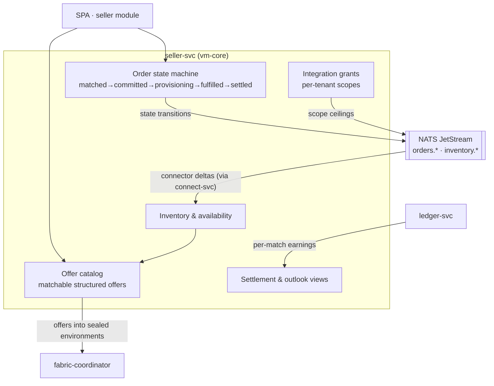

# AmisAd/seller — POC design

> One sentence: seller-svc runs the multi-tenant catalog, inventory, and order state machine that matching consumes and settlement pays — fed by hand through the SPA or by connectors through AmisAd/connect.

See [../design.md](../design.md#9-diagrams) · [../applications.md](../applications.md#amisadseller).

**POC notes**

- **Multi-tenant from day one:** tenant ID on every row in the `seller` schema; scenario seeds create Elena plus the deliberately out-of-range seller SCENARIO-002 asserts is filtered.
- **Matchability is the catalog's contract:** offers carry structured attributes (price, exclusion-relevant fields like color, reach, fitting slots, standing-deal terms) so environments evaluate them without interpretation.
- **The order state machine is event-sourced onto NATS:** each transition is an `orders.*` event consumed by the SPA views, the buyer's pseudonymous status channel, connect-svc webhooks, and settlement triggering — one truth, four consumers.
- **Match notifications contain need context only** — the seller-side record has no buyer identity field at all, so SCENARIO-002's assertion is structural, not filtered.
- **Integration grants** define the ceiling connect-svc credentials can hold; revocation kills sync without touching catalog data (SCENARIO-007 steps 3, 9).

**Scenario coverage:** 001, 002, 003, 005, 006, 007, 008, 009.

---

LICENSEURI https://yuruna.link/license

Copyright (c) 2026 by Alisson Sol et al.
