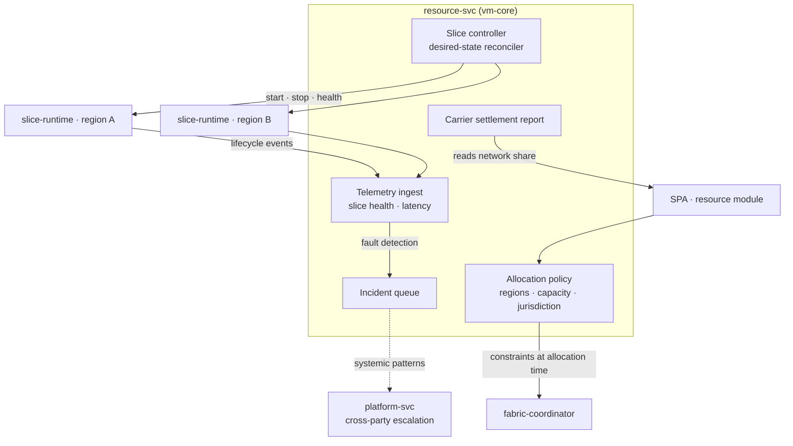

# AmisAd/resource — POC design

> One sentence: resource-svc is the carrier control plane — declarative allocation policy, the slice controller that drives the edge VMs, telemetry, incidents, and the carrier's settlement view.

See [../design.md](../design.md#9-diagrams) · [../applications.md](../applications.md#amisadresource).

**POC notes**

- **Jurisdiction is enforced at allocation time:** the coordinator asks resource-svc for a placement decision per match; s004.failover asserts the restricted-jurisdiction buyer never lands on the wrong region even when it has more capacity.
- **The slice controller is a desired-state reconciler** (the Ordem/Progresso pattern): policy declares what each edge VM should run; the controller converges actual state and reports drift — a mid-match kill (s004.failover's injected fault) shows up as drift, the environment self-terminates, and the retry allocates fresh.
- **Telemetry** streams over NATS from the slice runtimes; the POC dashboard shows live slices, capacity, and lifecycle counts per region.
- **Carrier settlement** is a read model over ledger-svc filtered to network-share entries — hosting revenue exists only for completed matches (aborted environments earn nothing, asserted in s004.failover).

**Scenario coverage:** s001.fulfillment, s004.failover.

---

LICENSEURI https://yuruna.link/license

Copyright (c) 2026 by Alisson Sol et al.
