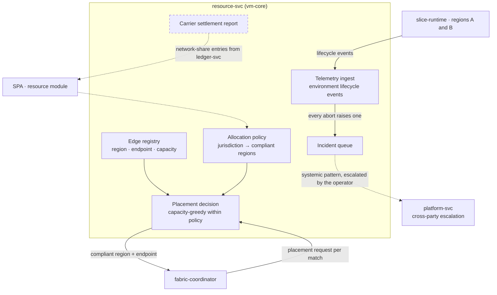

# AmisAd/resource — POC design

> One sentence: resource-svc is the carrier control plane — the edge registry and declarative allocation policy that decide where a match may run, plus telemetry, incidents, and the carrier's settlement view.

See [../design.md](../design.md#9-diagrams) · [../applications.md](../applications.md#amisadresource). Dashed = designed, not built.

**POC notes**

- **Jurisdiction is enforced at allocation time:** the coordinator asks resource-svc for a placement decision per match. The default is capacity-greedy across all regions, and the jurisdiction policy is what overrides it — s004.failover asserts both halves, that the restricted buyer lands on the compliant region and that the roomier non-compliant one was excluded rather than merely unlucky. A jurisdiction with no compliant edge in capacity gets no placement at all, not a fallback.
- **The edge registry is the desired state,** and the POC converges it from outside: each slice VM's `slice-runtime` is delivered and started per scenario run, then registered here with its region, endpoint, and capacity. A controller reconciling that registry — starting, stopping, and health-checking runtimes, reporting drift — is the growth-path step; nothing in the POC drives an edge VM from this service.
- **Failure is handled by fail-safe plus retry, not by drift detection:** an isolation fault makes the environment self-terminate before it opens the envelope, its abort telemetry raises an incident here, and the coordinator retries into the same compliant placement (three attempts) — so recovery is the fabric's job and safety is the environment's.
- **Telemetry** is posted by the slice runtimes on every lifecycle event, which is also how incidents are derived: an `aborted` event *is* an operator incident, not just a log line.
- **Carrier settlement** is designed as a read model over ledger-svc filtered to network-share entries. The network share is already a party in every recorded split — hosting revenue exists only for completed matches, and s004.failover asserts that directly on the ledger — but the report itself is not built here yet.

**Scenario coverage:** s001.fulfillment, s004.failover — and every scenario that dispatches an environment allocates through it.

---

LICENSEURI https://yuruna.link/license

Copyright (c) 2026 by Alisson Sol et al.
