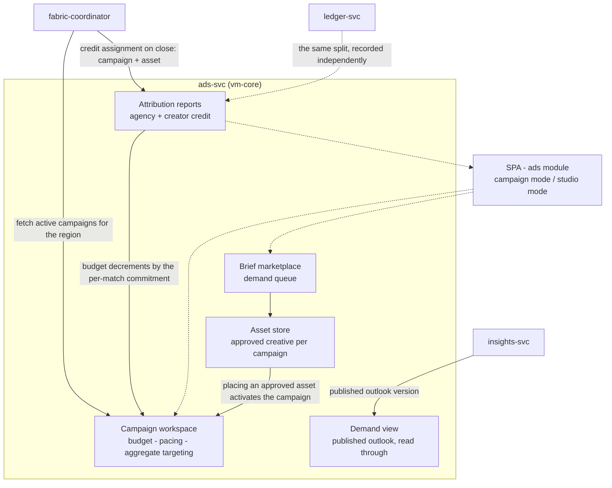

# AmisAd/ads — POC design

> One sentence: ads-svc runs campaigns and the creative studio as two role-scoped modes over one marketplace core, with creative rendered only inside sealed environments and credit arriving only from the attribution ledger.

See [../design.md](../design.md#9-diagrams) - [../applications.md](../applications.md#amisadads). Dashed = designed, not built.

**POC notes**

- **Two modes, one service:** the agency tenant and the creator account work the same APIs from different ends -- campaign and brief routes for Marcel, asset routes and the performance view for Kai. Scoping those routes by a role claim in the token is a growth-path step; the POC separates the modes by route, not by credential.
- **Creative travels into the environment:** the coordinator fetches the region's active campaigns and ships them into the sealed environment with the offers, and the environment is where a campaign qualifies an offer and the creative is rendered (s005.attribution asserts the asset in the environment's ingress log and no buyer signal anywhere campaign-side).
- **Attribution is computed in the fabric**, not here: this service records the credit assignment the coordinator posts when a boosted match closes, keyed by campaign, asset, and an opaque match id. There is no code path from campaign data to any individual match participant, and the reports it serves are aggregate totals.
- **Budget pacing decrements on match outcomes**, never on impressions, and the cap is enforced at attribution time -- a commitment the remaining budget cannot fund is refused rather than booked. The POC asserts the decrement equals the per-match commitment.
- **Asset store** is metadata plus a creative reference for the POC, and an asset lands approved. The brief -> draft -> approved -> placed lifecycle and revision history are the design; only approval-to-placement is exercised, and placement is what activates the campaign.

**Scenario coverage:** s005.attribution, s009.suppression.

---

LICENSEURI https://yuruna.link/license

Copyright (c) 2026 by Alisson Sol et al.
