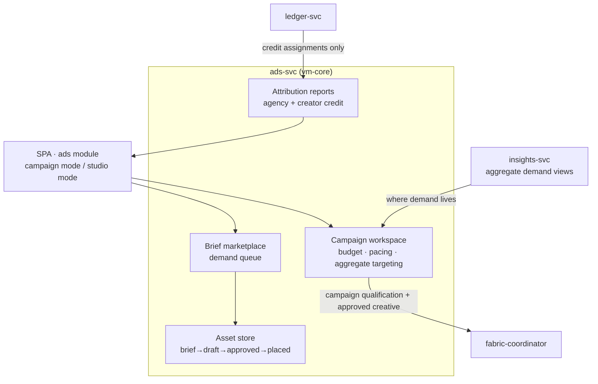

# AmisAd/ads — POC design

> One sentence: ads-svc runs campaigns and the creative studio as two role-scoped modes over one marketplace core, with creative rendered only inside sealed environments and credit arriving only from the attribution ledger.

See [../design.md](../design.md#9-diagrams) · [../applications.md](../applications.md#amisadads).

**POC notes**

- **Two modes, one service:** JWT role claims (agency tenant vs. creator account) scope every route; the SPA module renders campaign mode for Marcel and studio mode for Kai off the same APIs.
- **Creative travels into the environment:** approved assets are what the coordinator ships alongside qualified offers; rendering happens inside the sealed environment (SCENARIO-005 asserts the asset in the ingress log and no buyer signal anywhere campaign-side).
- **Attribution is computed in the fabric**, not here: ads-svc only reads credit assignments from ledger-svc — there is no code path from campaign data to any individual match participant.
- **Budget pacing decrements on match outcomes** (settlement events), never on impressions; the POC asserts the decrement equals the per-match commitment.
- **Asset store** is file upload + metadata for POC (production creative tooling is out of scope); the lifecycle states and revision history are real.

**Scenario coverage:** 005, 009.

---

LICENSEURI https://yuruna.link/license

Copyright (c) 2026 alius-git
