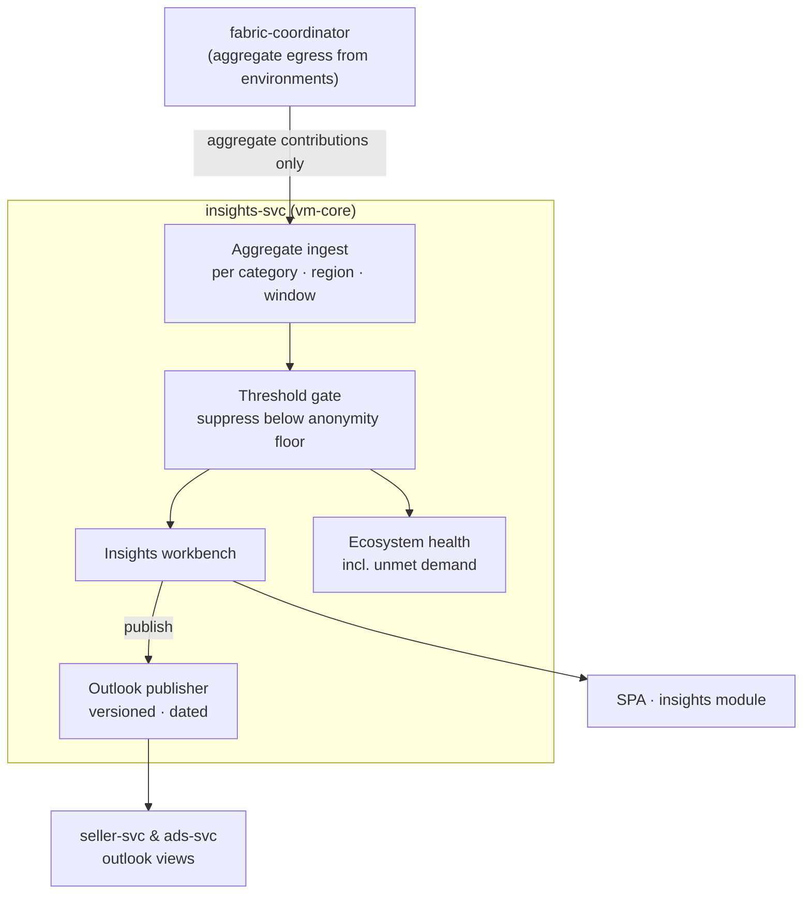

# AmisAd/insights — POC design

> One sentence: insights-svc turns threshold-protected aggregate contributions from the fabric into versioned demand outlooks — and the anonymity threshold is enforced in the pipeline, not by analyst discipline.

See [../design.md](../design.md#9-diagrams) · [../applications.md](../applications.md#amisadinsights).

**POC notes**

- **Individual data never arrives:** the service's only input is the aggregate egress of sealed environments, already grouped by category/region/window. There is no raw table for the threshold to protect — the gate suppresses small groups on top of already-aggregated input (defense in depth).
- **Suppression is indistinguishable from absence:** below-floor cells are dropped, not zeroed — SCENARIO-009 asserts the below-threshold region appears in no downstream view of any application.
- **Outlooks are published products:** versioned, dated rows that seller-svc and ads-svc read; all consumers of a version see identical figures (asserted in SCENARIO-009 step 5).
- **Unmet demand** compares aggregate need counts against match counts per category/region — the growth signal, carrying category and region only.
- **POC threshold is a config value** (deliberately low so lab-scale seeds can cross it); production tuning is a growth-path concern, the gate's position in the pipeline is not.

**Scenario coverage:** 005 (demand views), 009.

---

LICENSEURI https://yuruna.link/license

Copyright (c) 2026 alius-git
