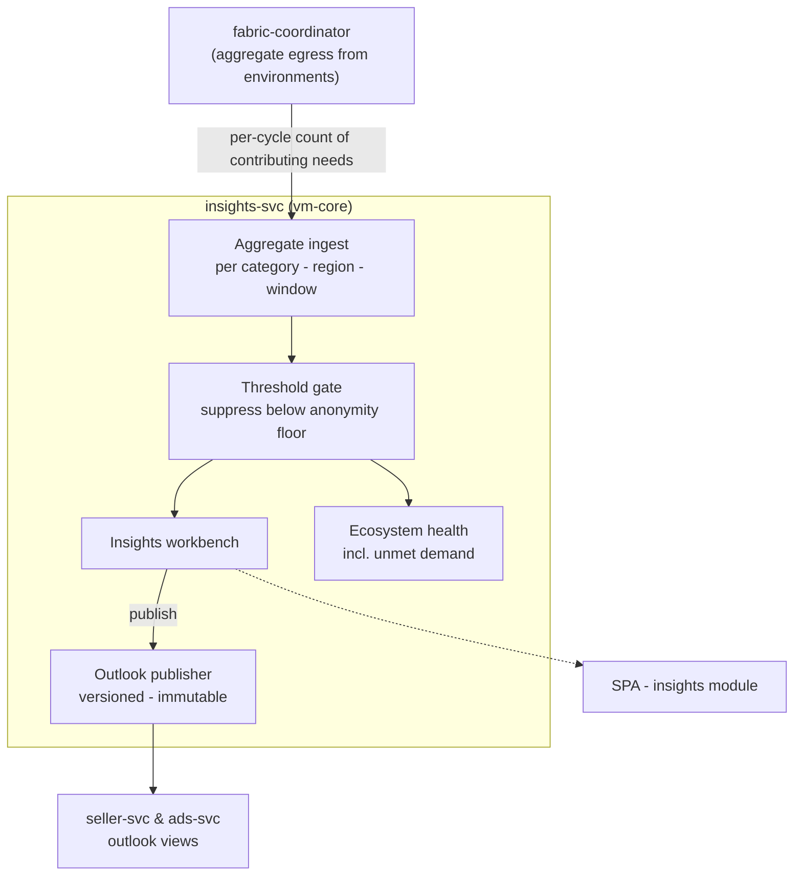

# AmisAd/insights — POC design

> One sentence: insights-svc turns threshold-protected aggregate contributions from the fabric into versioned demand outlooks -- and the anonymity threshold is enforced in the pipeline, not by analyst discipline.

See [../design.md](../design.md#9-diagrams) - [../applications.md](../applications.md#amisadinsights). Dashed = designed, not built.

**POC notes**

- **Individual data never arrives:** the service's only input is aggregate, already grouped by category/region/window -- counts, never content. The aggregation cycle pulls one number from the fabric, the count of consent-contributing open needs, so withdrawing contribution (s003.silence) shows up as an absent contribution rather than a filtered one. There is no raw table for the threshold to protect -- the gate suppresses small groups on top of already-aggregated input (defense in depth).
- **Suppression is indistinguishable from absence:** below-floor cells are dropped, not zeroed -- s009.suppression asserts the below-threshold region appears in no downstream view of any application.
- **Outlooks are published products:** versioned, immutable rows that seller-svc and ads-svc read straight through; all consumers of a version see identical figures (asserted in s009.suppression step 5).
- **Unmet demand** compares aggregate need counts against supply per category/region -- the growth signal, carrying category and region only.
- **The threshold is one constant in the service** (deliberately low so lab-scale seeds can cross it), applied at a single point every read path passes through. Making it configurable and tuning it are growth-path concerns; the gate's position in the pipeline is not.

**Scenario coverage:** s005.attribution (demand views), s009.suppression.

---

LICENSEURI https://yuruna.link/license

Copyright (c) 2026 by Alisson Sol et al.
