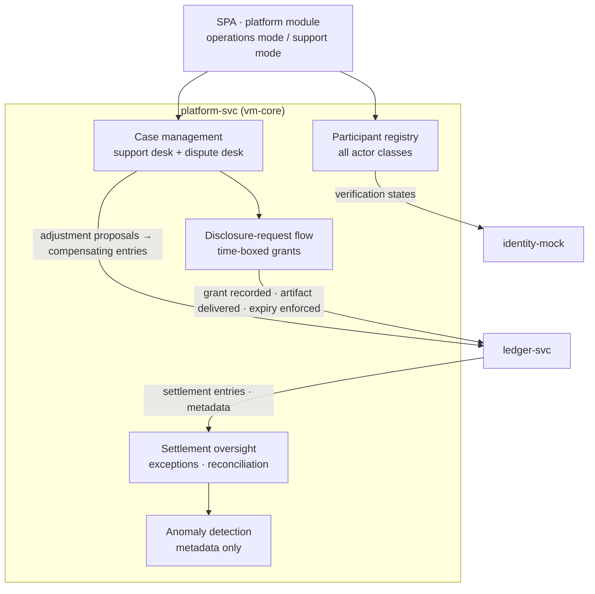

# AmisAd/platform — POC design

> One sentence: platform-svc is the stewardship console — operations mode for Priya, zero-knowledge support desk for Sam — where the registry, settlement oversight, and dispute machinery live without any path into match content.

See [../design.md](../design.md#9-diagrams) · [../applications.md](../applications.md#amisadplatform).

**POC notes**

- **Two modes, one service:** operations routes (registry, policy, escalated disputes) require Priya's role claim; support routes (case queue, disclosures, adjustments) require Sam's. Every action in either mode is written to an operator action log.
- **Zero-knowledge is structural:** case records reference orders and settlement entries by ID; there is no join path from a case to buyer identity — the schema doesn't contain one (SCENARIO-008 asserts the case record is identity-free throughout).
- **Disclosure grants** live in the consent ledger: request → grant → single artifact delivered read-only → automatic expiry; the POC enforces expiry by key invalidation and asserts the access path dies (SCENARIO-008 step 8).
- **Adjustments are proposals until accepted:** the counterparty accepts in their own application; only then does ledger-svc post the compensating entries referencing the case.
- **Anomaly detection** in POC is rule-based over settlement and case metadata (rates, conflicts, repeat patterns) — enough for SCENARIO-008's recurring-pattern escalation; statistical models are growth path.

**Scenario coverage:** 004, 007, 008, 010.

---

LICENSEURI https://yuruna.link/license

Copyright (c) 2026 by Alisson Sol et al.
