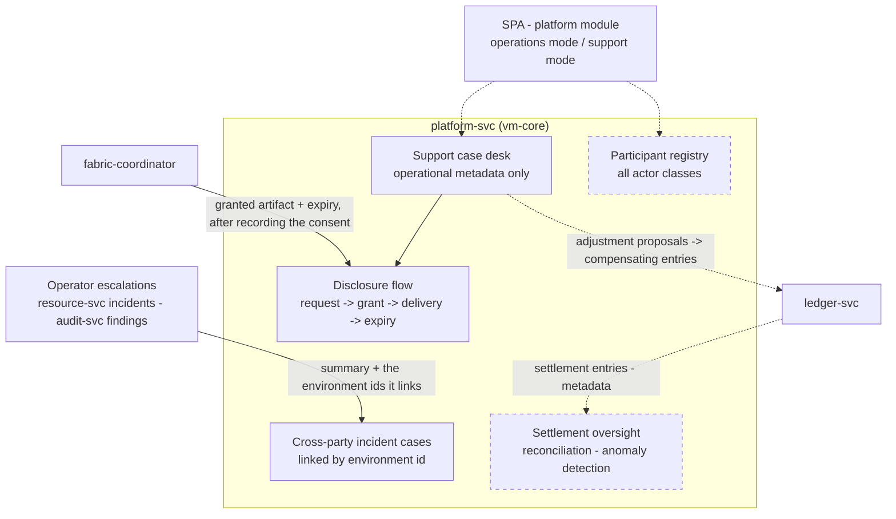

# AmisAd/platform — POC design

> One sentence: platform-svc is the stewardship console -- operations mode for Priya, zero-knowledge support desk for Sam -- where the registry, settlement oversight, and dispute machinery live without any path into match content.

See [../design.md](../design.md#9-diagrams) - [../applications.md](../applications.md#amisadplatform). Dashed = designed, not built.

**POC notes**

- **Two desks, one service:** the operations desk holds cross-party incident cases, the support desk holds buyer-reported cases and their disclosures. Both are separated by route today; scoping them to Priya's and Sam's role claims, and writing every action to an operator action log, is the growth-path step.
- **Zero-knowledge is structural:** case records reference orders, environments, and settlement entries by ID; there is no join path from a case to buyer identity -- the record has no such field (s008.mediation asserts the case record is identity-free throughout).
- **Escalation is deliberately inbound.** Nothing in this service reaches into another: an abort pattern in Tom's queue and a certification finding from Ingrid both arrive as posted cases carrying only a summary and the environment ids they link, which is what keeps the stewardship console free of any path into match content.
- **Disclosure is a two-service flow:** Sam requests it here, the buyer grants it through the coordinator, and the coordinator records the grant on the consent ledger under the buyer's pseudonymous subject before delivering the artifact here with its expiry. This service then serves that one artifact read-only until the expiry passes, after which the access path returns gone rather than forbidden (s008.mediation step 8).
- **Adjustments are posted to ledger-svc** as compensating entries referencing the case, so history is never edited. Routing them as proposals the counterparty accepts in their own application -- with the entries posted only on acceptance -- is designed but not built.
- **Anomaly detection** over settlement and case metadata (rates, conflicts, repeat patterns) is designed as rule-based, with statistical models on the growth path. In the POC the recurring pattern is spotted by the operator, who escalates it as a case.

**Scenario coverage:** s004.failover, s008.mediation, s010.certification.

---

LICENSEURI https://yuruna.link/license

Copyright (c) 2026 by Alisson Sol et al.
