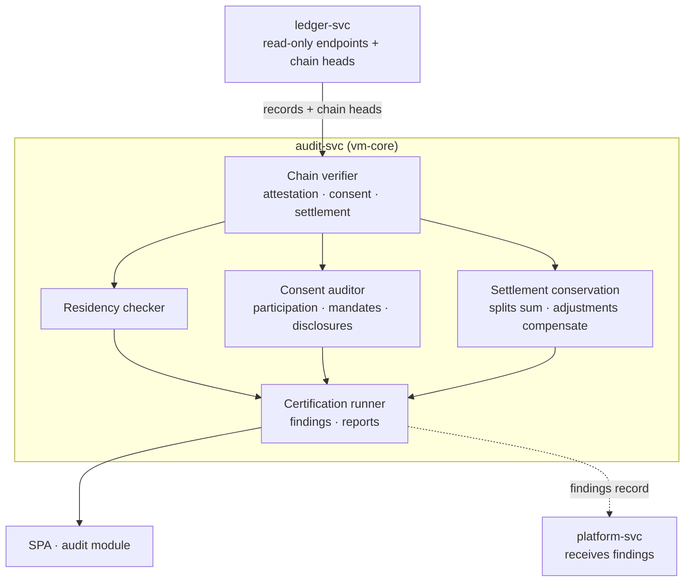

# AmisAd/audit — POC design

> One sentence: audit-svc independently verifies the hash chains, residency, consent, and settlement conservation of everything the other services produced — holding read-only credentials and no personal-data scope, so its independence is architectural.

See [../design.md](../design.md#9-diagrams) · [../applications.md](../applications.md#amisadaudit).

**POC notes**

- **Independent verification, not trusted summaries:** the verifier recomputes hash chains from raw ledger records and compares against published chain heads — s010.certification's tamper injection (a modified record copy) must be detected and localized by recomputation, not flagged by the platform.
- **Read-only by credential and by schema:** audit-svc holds a PostgreSQL role with SELECT only on ledger schemas and no route that writes anywhere except its own findings store; its access log is itself evidence (s010.certification step 8).
- **The four certification dimensions** map one-to-one to s010.certification steps: attestation continuity, residency vs. rules-in-force, consent validity at execution time (all three grant types), and settlement conservation (splits sum to match value; adjustments reference cases and compensate exactly).
- **Reports** are generated artifacts (jurisdiction-scoped findings + public summary) stored with the run; the POC asserts completeness against the seeded corpus of scenarios s001–s009.

**Scenario coverage:** s010.certification (consuming the evidence of s001–s009).

---

LICENSEURI https://yuruna.link/license

Copyright (c) 2026 by Alisson Sol et al.
