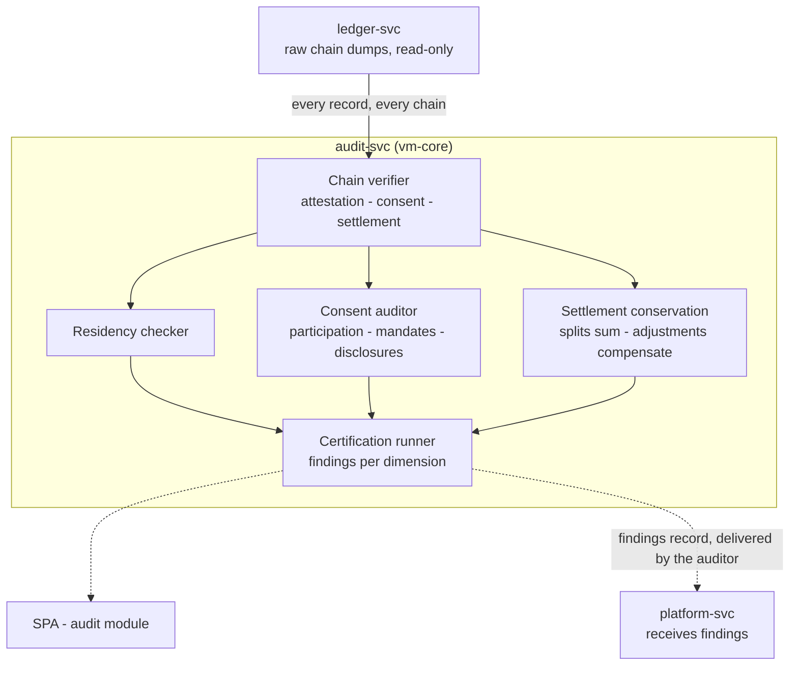

# AmisAd/audit — POC design

> One sentence: audit-svc independently verifies the hash chains, residency, consent, and settlement conservation of everything the other services produced -- holding read-only credentials and no personal-data scope, so its independence is architectural.

See [../design.md](../design.md#9-diagrams) - [../applications.md](../applications.md#amisadaudit). Dashed = designed, not built.

**POC notes**

- **Independent verification, not trusted summaries:** the verifier pulls the raw records and recomputes every chain itself -- genesis linkage and `sha256(prev_hash || payload)` per row -- so it trusts no self-report from the ledger, not even the ledger's own verify endpoint. s010.certification's tamper injection (a modified copy of the attestation records) is detected and localized to the exact row by that recomputation, not flagged by the platform.
- **Read-only by construction:** audit-svc reaches the ledger only through read endpoints, holds no database connection, writes nothing anywhere -- findings are returned to the caller, not stored -- and records every read in an access log that is itself evidence (s010.certification step 8). The `amisad_audit_ro` PostgreSQL role -- USAGE plus SELECT on the ledger schemas, nothing more -- is provisioned for the direct-SQL reads that come with the growth path.
- **The four certification dimensions** map one-to-one to s010.certification steps: attestation continuity (every environment reads created -> attested -> executed *or* aborted -> destroyed), residency (the attested region satisfies the jurisdiction), consent (the chain is intact across all four grant types), and settlement conservation (splits sum to match value; adjustments compensate and reference a case).
- **Findings are returned per dimension** with a violation count and an overall verdict. Storing them with the run, as jurisdiction-scoped artifacts plus a public summary, is the growth-path step -- which is also why the findings reach Priya's operations queue as a case the auditor files rather than a record this service pushes.
- **The corpus is self-seeded.** Every scenario resets to the same deployed snapshot, so nothing s001-s009 produced survives into this run; s010 builds a representative corpus spanning all four dimensions -- a completed match plus an injected abort, consent grant and revocation, a mandate, a disclosure and its adjustment -- and certifies that.

**Scenario coverage:** s010.certification (consuming the evidence of s001-s009).

---

LICENSEURI https://yuruna.link/license

Copyright (c) 2026 by Alisson Sol et al.
