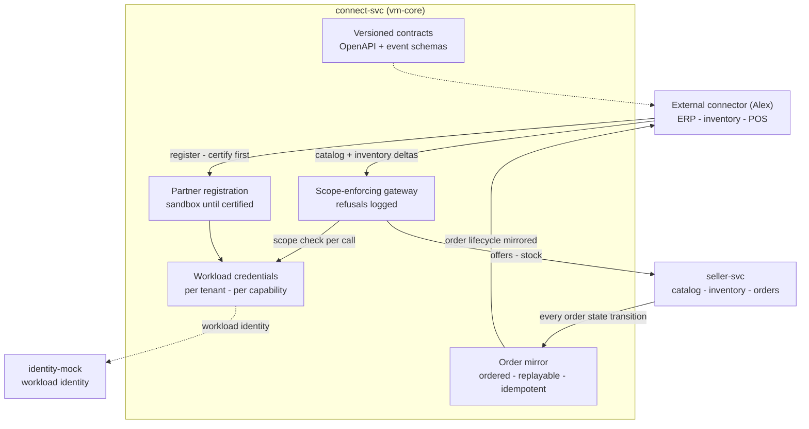

# AmisAd/connect — POC design

> One sentence: connect-svc is the supply-side integration gateway -- versioned contracts, sandbox tenants, least-privilege workload credentials, and replayable event sync -- with no buyer-related surface in any contract, by construction.

See [../design.md](../design.md#9-diagrams) - [../applications.md](../applications.md#amisadconnect). Dashed = designed, not built.

**POC notes**

- **The gateway enforces scope on every call:** a credential is minted here for one tenant and exactly the capabilities the seller granted (catalog, inventory, orders), and every call resolves it before doing anything -- unknown or revoked fails closed, out of scope is refused, logged, and returns nothing (s007.inventory). The credential is an opaque string in the POC; making it a workload JWT issued by `identity-mock`, with the seller's own grant record as the ceiling, is the growth-path step.
- **Sandbox-first is a promotion gate:** a partner registers with sandbox access only and certifies its connector against the same contracts before anything else is possible. Promotion to production-eligible belongs to the platform participant registry, which the POC does not have -- so sandbox and certification are tracked here.
- **Delivery is ordered, at-least-once, and idempotent at the consumer:** each order transition mirrors to the ERP under a `(match_id, state)` key, and the mirror advances monotonically, so a replayed or late-arriving delivery converges to the same order state with no duplicate effects and never regresses one (s007.inventory step 8). JetStream replaces the transport without changing that contract.
- **Revocation kills credentials, not data:** revoking the grant invalidates the credential at the gateway immediately; the catalog remains intact and hand-editable (s007.inventory step 9).
- **No buyer surface exists to leak:** contract files contain no buyer identity, need content, or match detail fields -- the privacy constraint is checked at the contract level (a CI rule over `poc/contracts/` on the growth path).
- **The connector is played by the scenario,** driving these APIs as Elena's ERP would; a reference connector binary is optional, and real ERP adapters are Alex's product, not ours.

**Scenario coverage:** s007.inventory.

---

LICENSEURI https://yuruna.link/license

Copyright (c) 2026 by Alisson Sol et al.
