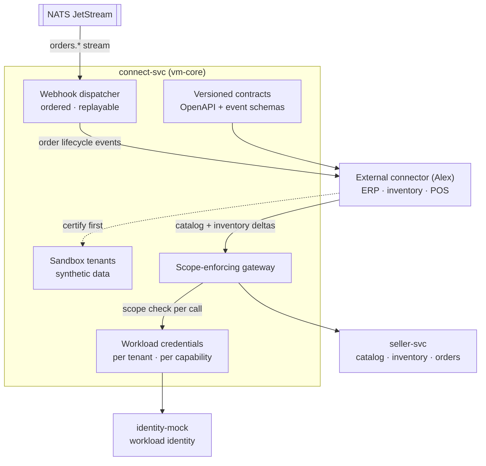

# AmisAd/connect — POC design

> One sentence: connect-svc is the supply-side integration gateway — versioned contracts, sandbox tenants, least-privilege workload credentials, and replayable event sync — with no buyer-related surface in any contract, by construction.

See [../design.md](../design.md#9-diagrams) · [../applications.md](../applications.md#amisadconnect).

**POC notes**

- **The gateway enforces scope on every call:** credentials are workload JWTs bound to (partner, tenant, capability); the ceiling is the seller's grant in seller-svc. s007.inventory asserts the out-of-scope call is refused, logged, and returns nothing.
- **Sandbox-first is a promotion gate:** a connector certifies against a synthetic tenant running the same contracts before Priya's registry marks it production-eligible.
- **Webhook delivery rides JetStream:** ordered, at-least-once, consumer-side idempotency keys — a replayed delivery converges to the same order state with no duplicate effects (s007.inventory step 8).
- **Revocation kills credentials, not data:** the seller's grant revocation invalidates tokens at the gateway immediately; the catalog remains intact and hand-editable (s007.inventory step 9).
- **No buyer surface exists to leak:** contract files contain no buyer identity, need content, or match detail fields — the privacy constraint is checked at the contract level (a CI rule over `poc/contracts/` on the growth path).
- **POC ships one reference connector** (a small Rust binary simulating Elena's ERP) used by the scenario seeds; real ERP adapters are Alex's product, not ours.

**Scenario coverage:** s007.inventory.

---

LICENSEURI https://yuruna.link/license

Copyright (c) 2026 by Alisson Sol et al.
