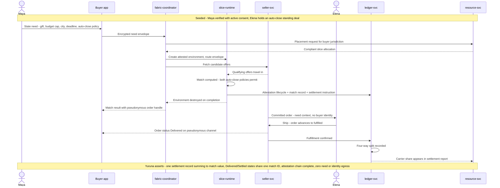

# SCENARIO-001 sequence — Intent-Driven Edge Match and Automated Fulfillment

> One sentence: a private need auto-closes against a standing offer inside a sealed edge environment and settles across all four parties — the golden path.

See [00-index.md](00-index.md) · [SCENARIO-001](../scenarios.md#scenario-001-intent-driven-edge-match-and-automated-fulfillment). Tom is folded into resource-svc (he observes its settlement report).

