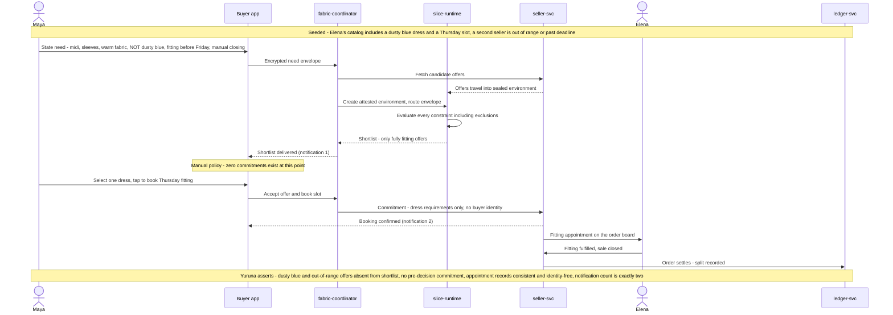

# SCENARIO-002 sequence — Considered Purchase, Constraint Fidelity, and In-Person Booking

> One sentence: a constraint-rich need returns a shortlist that honors every constraint including exclusions, nothing commits until the buyer decides, and a one-tap booking reaches the seller without her identity.

See [00-index.md](00-index.md) · [SCENARIO-002](../scenarios.md#scenario-002-considered-purchase-constraint-fidelity-and-in-person-booking).

