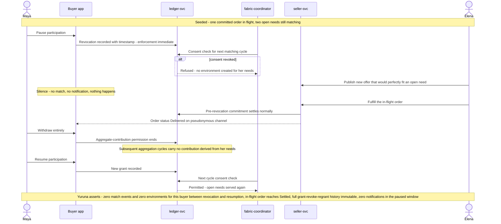

# SCENARIO-003 sequence — Consent Revocation and the Right to Silence

> One sentence: pausing participation stops matching at the consent check itself, committed orders still complete, withdrawal ends aggregate contribution, and resumption restores service — all immutably recorded.

See [00-index.md](00-index.md) · [SCENARIO-003](../scenarios.md#scenario-003-consent-revocation-and-the-right-to-silence).

