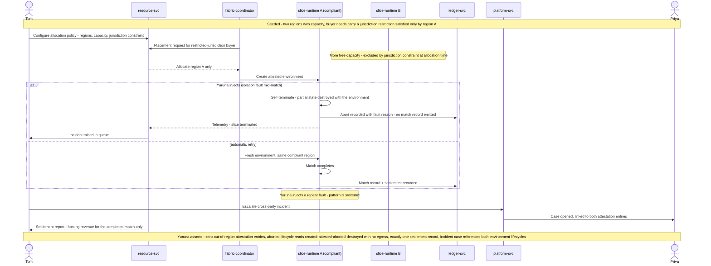

# SCENARIO-004 sequence — Sovereign Slice Allocation, Isolation Fault, and Attested Failover

> One sentence: jurisdiction rules pick the compliant region over the roomier one, an injected isolation fault destroys the environment safely and retries clean, and the systemic pattern escalates across party lines.

See [../design.md](../design.md#9-diagrams) · [SCENARIO-004](../scenarios.md#scenario-004-sovereign-slice-allocation-isolation-fault-and-attested-failover).

---

LICENSEURI https://yuruna.link/license

Copyright (c) 2026 by Alisson Sol et al.
