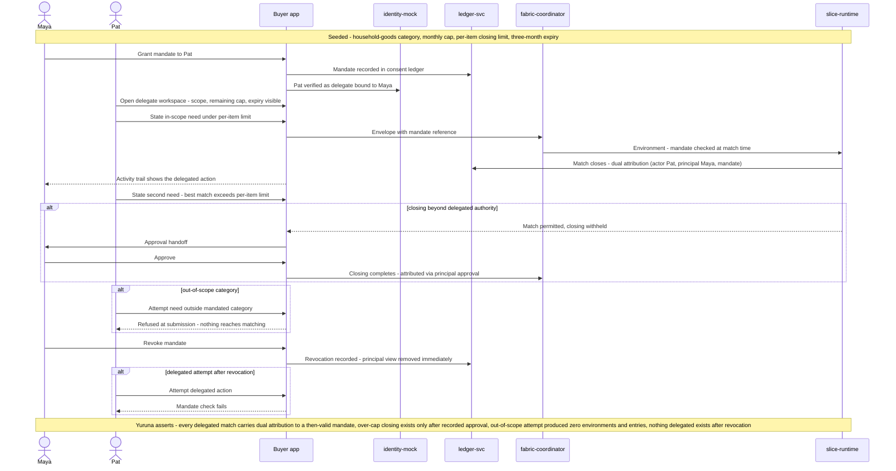

# SCENARIO-006 sequence — Delegated Procurement Under a Scoped Mandate

> One sentence: a mandate grants Pat bounded authority that the fabric enforces at match time — in-scope closes with dual attribution, over-cap routes to Maya, out-of-scope never reaches matching, and revocation is instant.

See [../design.md](../design.md#9-diagrams) · [SCENARIO-006](../scenarios.md#scenario-006-delegated-procurement-under-a-scoped-mandate). Elena's standing offer is folded into the coordinator's offer fetch.

---

LICENSEURI https://yuruna.link/license

Copyright (c) 2026 by Alisson Sol et al.
