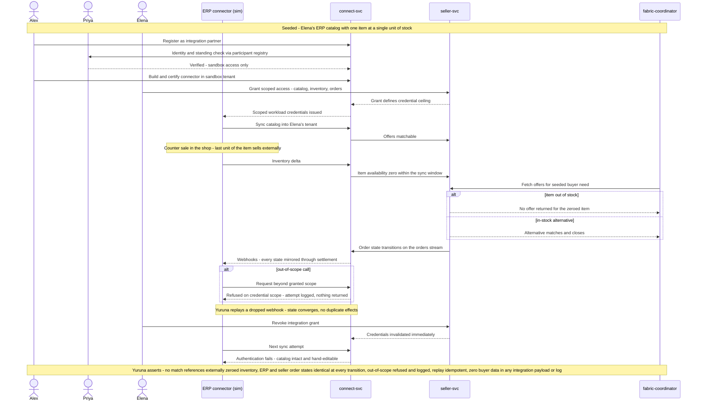

# SCENARIO-007 sequence — Enterprise Integration Onboarding and Inventory-Truth Matching

> One sentence: a verified connector certifies in sandbox, syncs ERP truth into matching, mirrors order states back out, and is refused beyond its scope — with replay converging and revocation killing credentials, not data.

See [../design.md](../design.md#9-diagrams) · [SCENARIO-007](../scenarios.md#scenario-007-enterprise-integration-onboarding-and-inventory-truth-matching). ledger-svc is folded into seller-svc's settlement step; the matching fabric is folded into the coordinator.

---

LICENSEURI https://yuruna.link/license

Copyright (c) 2026 alius-git
