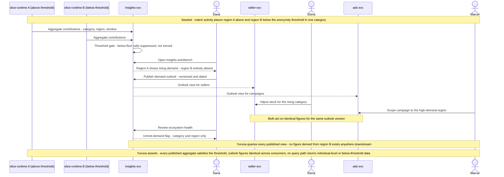

# SCENARIO-009 sequence — Aggregate Insight Publication and the Demand-Planning Loop

> One sentence: sealed environments emit only aggregates, the threshold gate suppresses the small region into indistinguishable absence, and one published outlook drives both stocking and campaign decisions.

See [../design.md](../design.md#9-diagrams) · [SCENARIO-009](../scenarios.md#scenario-009-aggregate-insight-publication-and-the-demand-planning-loop).

---

LICENSEURI https://yuruna.link/license

Copyright (c) 2026 alius-git
