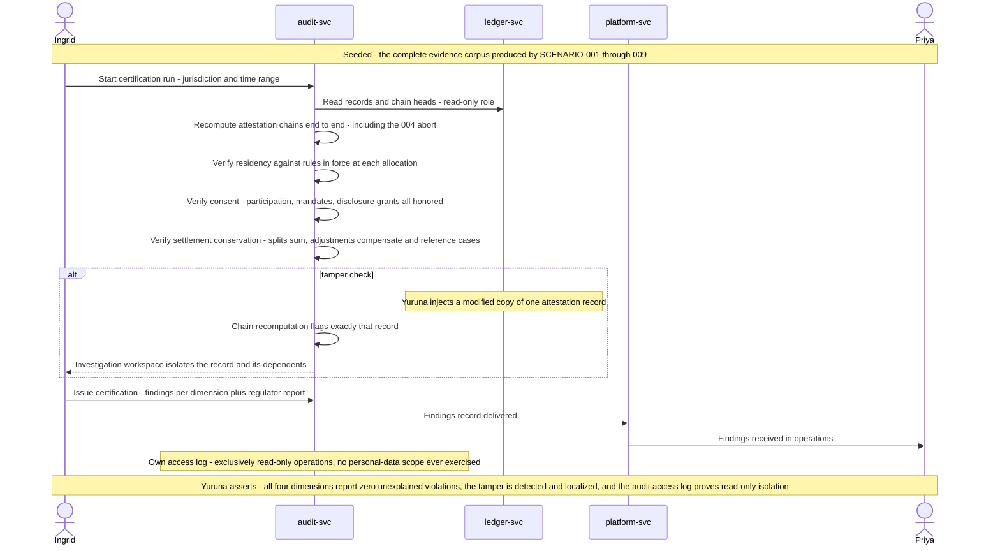

# SCENARIO-010 sequence — Independent Certification of the Full Evidence Trail

> One sentence: the auditor recomputes chains, residency, consent, and settlement conservation over everything scenarios 001–009 produced, catches an injected tamper by recomputation, and certifies on evidence — read-only throughout.

See [00-index.md](00-index.md) · [SCENARIO-010](../scenarios.md#scenario-010-independent-certification-of-the-full-evidence-trail).

