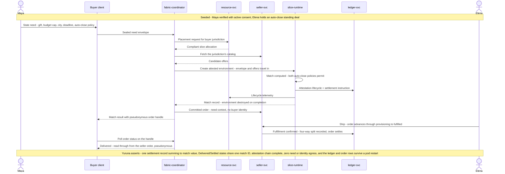

# s001.fulfillment sequence — Intent-Driven Edge Match and Automated Fulfillment

> One sentence: a private need auto-closes against a standing offer inside a sealed edge environment and settles across all four parties — the golden path.

See [../design.md](../design.md#9-diagrams) · [s001.fulfillment](../scenarios.md#s001fulfillment-intent-driven-edge-match-and-automated-fulfillment). Tom is folded into resource-svc (the carrier share he would read is a party in the recorded split).

---

LICENSEURI https://yuruna.link/license

Copyright (c) 2026 by Alisson Sol et al.
