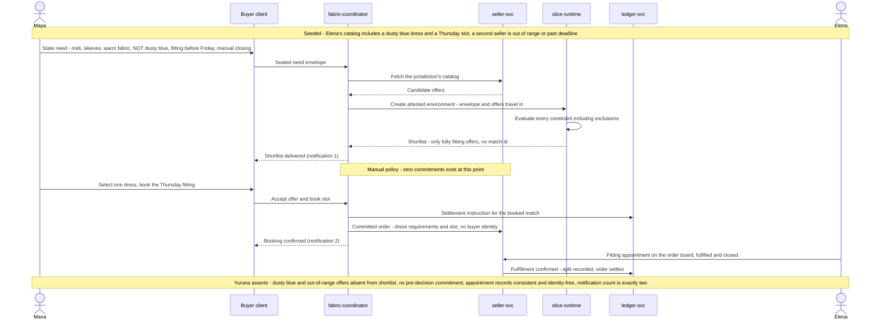

# s002.fitting sequence — Considered Purchase, Constraint Fidelity, and In-Person Booking

> One sentence: a constraint-rich need returns a shortlist that honors every constraint including exclusions, nothing commits until the buyer decides, and a one-tap booking reaches the seller without her identity.

See [../design.md](../design.md#9-diagrams) - [s002.fitting](../scenarios.md#s002fitting-considered-purchase-constraint-fidelity-and-in-person-booking).

---

LICENSEURI https://yuruna.link/license

Copyright (c) 2026 by Alisson Sol et al.
