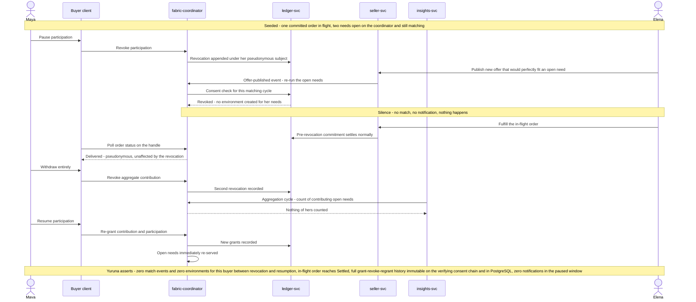

# s003.silence sequence — Consent Revocation and the Right to Silence

> One sentence: pausing participation stops matching at the consent check itself, committed orders still complete, withdrawal ends aggregate contribution, and resumption restores service — all immutably recorded.

See [../design.md](../design.md#9-diagrams) · [s003.silence](../scenarios.md#s003silence-consent-revocation-and-the-right-to-silence).

---

LICENSEURI https://yuruna.link/license

Copyright (c) 2026 by Alisson Sol et al.
