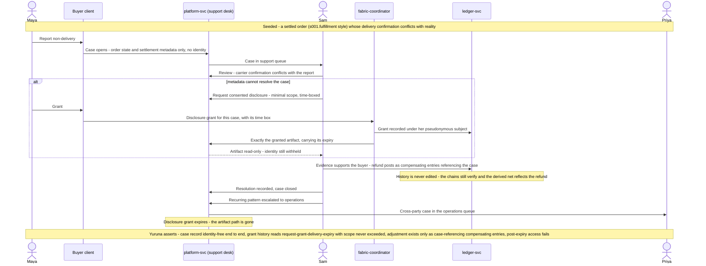

# s008.mediation sequence — Zero-Knowledge Dispute Mediation and Settlement Adjustment

> One sentence: a delivery dispute resolves on metadata plus one minimal, time-boxed, consented disclosure, the refund lands as compensating entries referencing the case — and the buyer stays anonymous throughout.

See [../design.md](../design.md#9-diagrams) · [s008.mediation](../scenarios.md#s008mediation-zero-knowledge-dispute-mediation-and-settlement-adjustment).

---

LICENSEURI https://yuruna.link/license

Copyright (c) 2026 by Alisson Sol et al.
