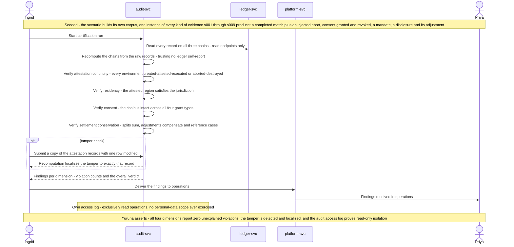

# s010.certification sequence — Independent Certification of the Full Evidence Trail

> One sentence: the auditor recomputes chains, residency, consent, and settlement conservation over a corpus spanning every kind of evidence s001–s009 produce, catches an injected tamper by recomputation, and certifies on evidence — read-only throughout.

See [../design.md](../design.md#9-diagrams) · [s010.certification](../scenarios.md#s010certification-independent-certification-of-the-full-evidence-trail).

---

LICENSEURI https://yuruna.link/license

Copyright (c) 2026 by Alisson Sol et al.
